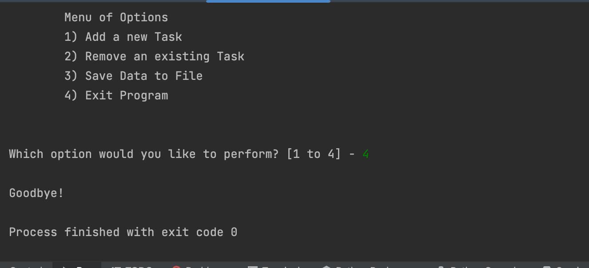
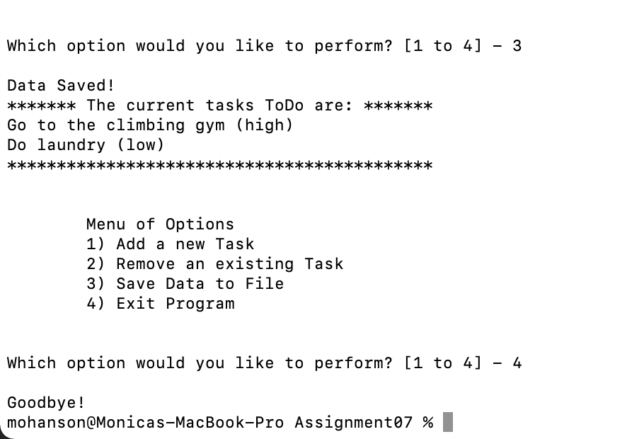

Monica Hanson

August 24, 2022

Foundations of Programming: Python

Assignment 07

GitHub Repo: 
https://github.com/mohanson333/-IntroToProg-Python-Mod07

**Error Handling and Pickling in Python**

**Introduction**

In this article I will discuss how I modified a script to use python’s pickling module and demonstrate error handling. In this module I learned that pickling in python is the process of converting a Python object into a byte stream to store it in a file. I also learned about structured error handling using try-except blocks. This can be useful when in debugging new errors in code.
**
Modifying the existing script**
I decided to use the previous week’s script but rather than write to a .txt file I used pickling and wrote to a .dat file. The script asks for a task from the user, then store it in a list object. Then store a list object into a binary file. Finally, the data saved in the binary file. Error handling was already included in the previous script so for this scenario I just verified it functioned as expected.

**Research:** 

The assignment asked us to research error handling and pickling on our own. The site that I found most useful for researching pickling was:

https://www.afternerd.com/blog/python-pickle/

I also did some research on error handling in python and found this site to be helpful:

https://realpython.com/python-exceptions/
https://www.w3schools.com/python/gloss_python_error_handling.asp

I picked these sites because they were concise, yet to the point and included some small examples.

 

**Testing:**

I tested multiple scenarios with my script using PyCharm (see figure 1).

 
Figure:1

In addition to testing with PyCharm I also tested using terminal. The script ran successfully (see figure 2).

  
Figure:2

**Summary:**

In this article I discussed how I went about modifying my previous week’s script to use pickling and error handling.
